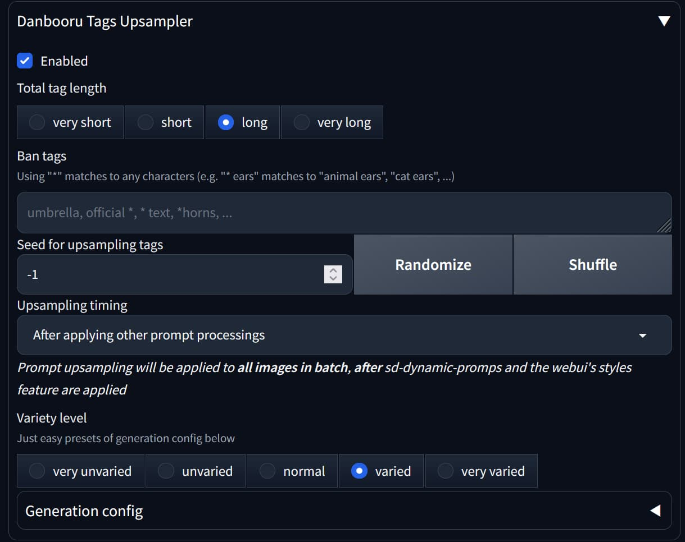
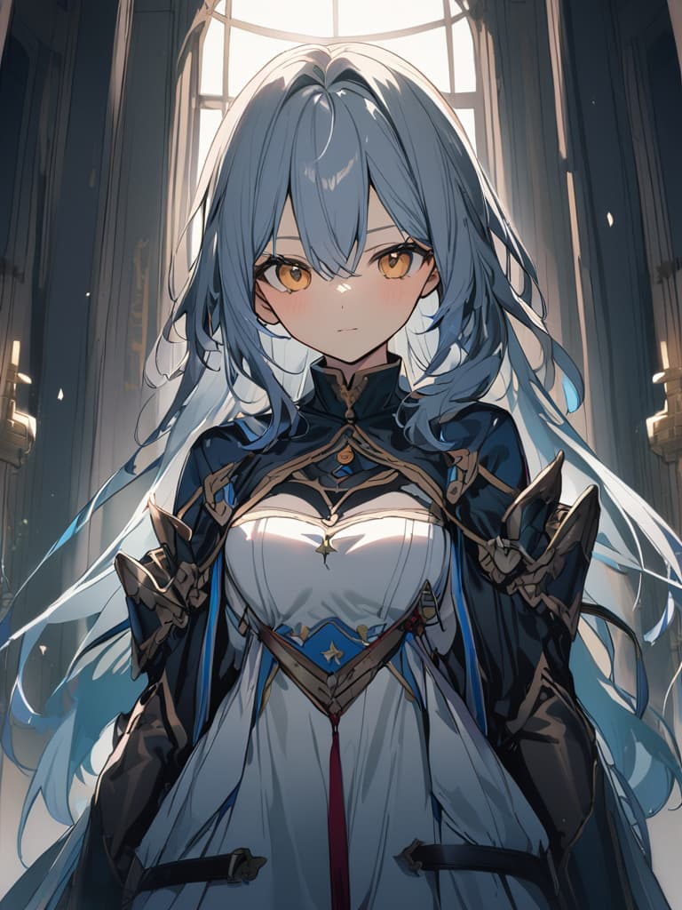
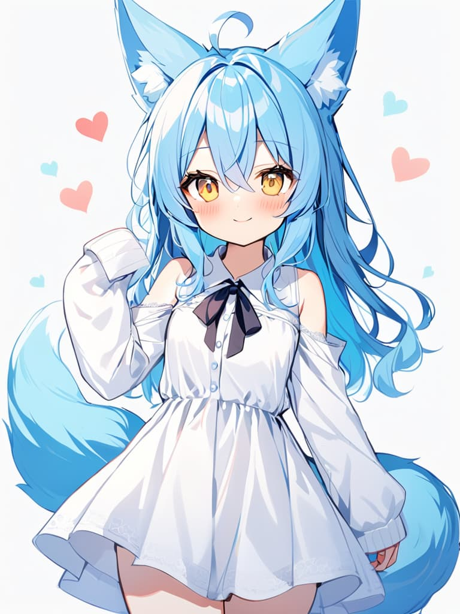
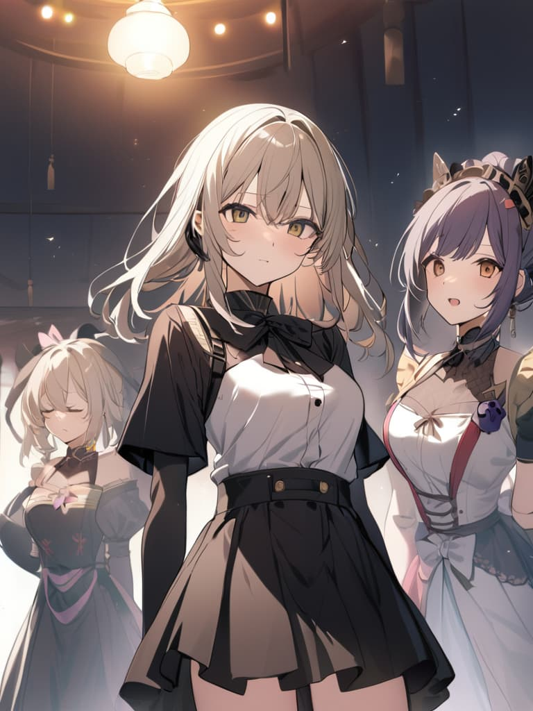
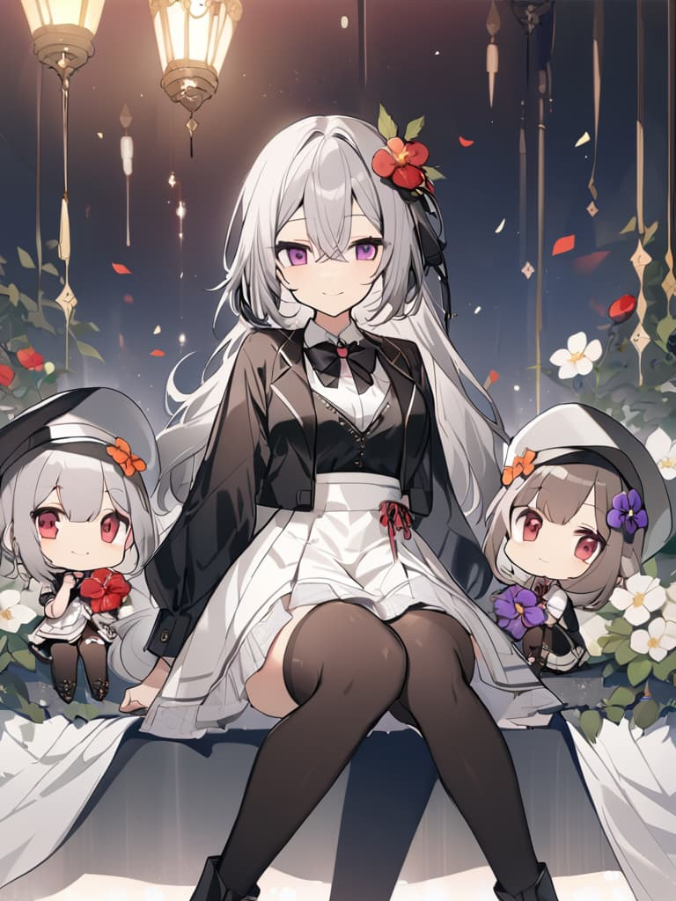
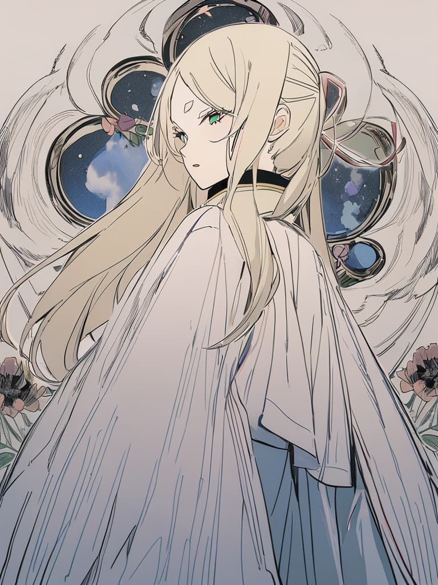
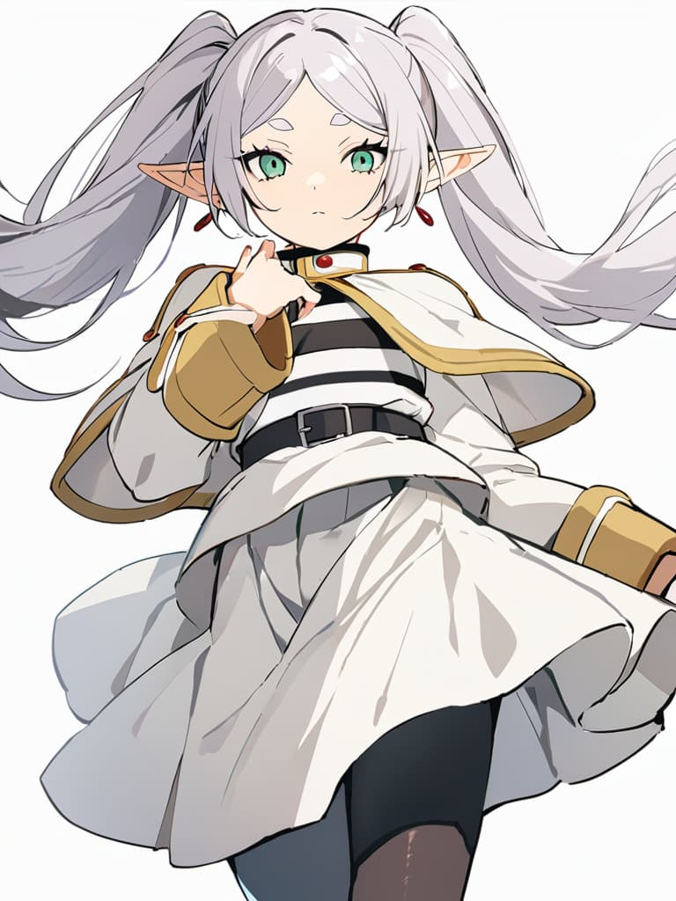

# sd-danbooru-tags-upsampler

English version is [here](./README.md).

これは軽量な LLM を利用して danbooru タグを生成/補完することで、プロンプトをアップサンプルすることができる Stable Diffusion WebUI 向けの拡張機能です。

長いプロンプトを考えたくない場合や、何も考えないで**多様**かつ**自然**で**高品質**な画像を見ていたいという場合に便利です。

## 使い方



`Danbooru Tags Upsampler`　と書かれたアコーディオンを開き、`Enabled` チェックボックスにチェックをいれることで拡張機能を有効化できます。

パラメーターの説明:

| パラメーター名 | 説明 | 例 |
| -------------- | ----------- | ------------- |
| **Total tag length** | これは **タグの補完後のプロンプト内のタグの総量を指定します**。 補完するタグの量ではありません。 `very short` は「タグ10個以下」, `short` は「タグ20個以下」, `long` は「タグ40個以下」、 `very long` は「それよりも多い」を意味します。 | 推奨は `long` です |
| **Ban tags** | ここで指定された全てのタグは補完時に出現しなくなります。出てきて欲しくないタグがあるときに便利です。 | `official alternate costume, english text, animal focus, ...` |
| **Seed for upsampling tags** | この値とポジティブプロンプトが固定された場合、補完されるタグも固定されます。`-1` は毎回ことなるシードで補完することを意味します。 | 毎回異なる補完をしてほしい場合は `-1` に設定します。 |
| **Upsampling timing** | sd-dynamic-prompts や webui の styles 機能などの、他のプロンプト加工処理が実行される前にアップサンプルするか、後にアップサンプルするかどうかです。 | `Before applying other prompt processing` |

## ショーケース

<table>
    <tr>
        <td width="30%">入力のプロンプト</td>
        <td width="30%">アップサンプル<b>なし</b></td>
        <td width="30%">アップサンプル<b>あり</b></td>
    </tr>
    <tr>
        <td>1girl, solo, cowboy shot (seed: 2396487241)</td>
        <td>
            
        </td>
        <td></td>
    </tr>
    <tr>
        <td>(最終的なプロンプト) </td>
        <td><b>1girl, solo, cowboy shot</b></td>
        <td><b>1girl, solo, cowboy shot, ahoge, animal ears, bare shoulders, blue hair, blush, closed mouth, collarbone, collared shirt, dress, eyelashes, fox ears, fox girl, fox tail, hair between eyes, heart, long hair, long sleeves, looking at viewer, neck ribbon, ribbon, shirt, simple background, sleeves past wrists, smile, tail, white background, white dress, white shirt, yellow eyes</b></td>
    </tr>
    <tr>
        <td>3girls (seed: 684589178)</td>
        <td>
            
        </td>
        <td></td>
    </tr>
    <tr>
        <td>(最終的なプロンプト) </td>
        <td><b>3girls</b></td>
        <td><b>3girls, black footwear, black hair, black thighhighs, boots, bow, bowtie, chibi, closed mouth, collared shirt, flower, grey hair, hair between eyes, hair flower, hair ornament, long hair, long sleeves, looking at viewer, multiple girls, purple eyes, red eyes, shirt, short hair, sitting, smile, thighhighs, vest, white shirt, white skirt</b></td>
    </tr>
    <tr>
        <td>no humans, scenery (seed: 3702717413)</td>
        <td>
            
        </td>
        <td></td>
    </tr>
    <tr>
        <td>(最終的なプロンプト) </td>
        <td><b>no humans, scenery</b></td>
        <td><b>no humans, scenery, animal, animal focus, bird, blue eyes, cat, dog, flower, grass, leaf, nature, petals, shadow, sitting, star (sky), sunflower, tree</b></td>
    </tr>
    <tr>
        <td>1girl, frieren, sousou no frieren
 (seed: 787304393)</td>
        <td>
            
        </td>
        <td></td>
    </tr>
    <tr>
        <td>(最終的なプロンプト) </td>
        <td><b>1girl, frieren, sousou no frieren</b></td>
        <td><b>1girl, frieren, sousou no frieren, black pantyhose, cape, closed mouth, elf, fingernails, green eyes, grey hair, hair between eyes, long hair, long sleeves, looking at viewer, pantyhose, pointy ears, simple background, skirt, solo, twintails, white background, white skirt</b></td>
    </tr>
</table>

生成設定:

- モデル: [AnimagineXL 3.0](https://huggingface.co/cagliostrolab/animagine-xl-3.0)
- ネガティブプロンプト (animaginexl 3.0 公式の推奨設定と同じ):

```
nsfw, lowres, bad anatomy, bad hands, text, error, missing fingers, extra digit, fewer digits, cropped, worst quality, low quality, normal quality, jpeg artifacts, signature, watermark, username, blurry, artist name
```

アップサンプル設定:

- Total tag length: `long`
- Ban tags: 指定なし
- Seed: `-1`
- When to perform the process: `Before applying styles`

## モデルへのアクセス

この拡張機能では次のモデルを使用しています:

- `p1atdev/dart-v1-sft`: [🤗 HuggingFace](https://huggingface.co/p1atdev/dart-v1-sft)

## Stable Diffusion WebUI なしで使いたいですか？

🤗 Space 上にデモがあるのでインストール不要で試すことができます:

デモ: https://huggingface.co/spaces/p1atdev/danbooru-tags-transformer

## 謝辞

このプロジェクトは以下のプロジェクトや研究の影響を受けています。 これらのプロジェクトの開発者および貢献者に敬意と感謝の意を表します:

- succinctly/text2image-prompt-generator: https://huggingface.co/succinctly/text2image-prompt-generator
- Gustavosta/MagicPrompt-Stable-Diffusion: https://huggingface.co/Gustavosta/MagicPrompt-Stable-Diffusion
- FredZhang7/anime-anything-promptgen-v2: https://huggingface.co/FredZhang7/anime-anything-promptgen-v2
- sd-dynamic-prompts: https://github.com/adieyal/sd-dynamic-prompts
- DALL-E 3: https://cdn.openai.com/papers/dall-e-3.pdf
- caption-upsampling: https://github.com/sayakpaul/caption-upsampling
- StableDiffusionWebUI: https://github.com/AUTOMATIC1111/stable-diffusion-webui とその派生物
